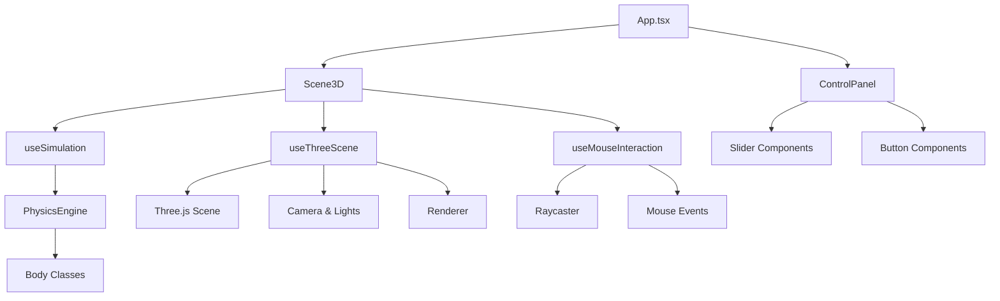
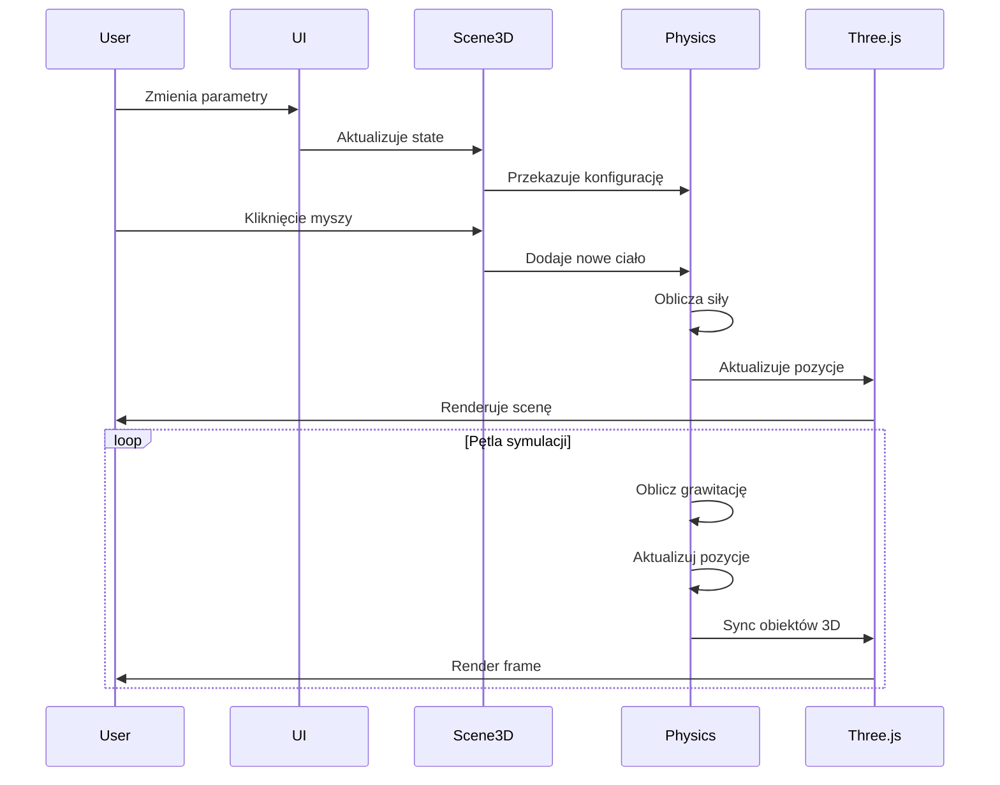
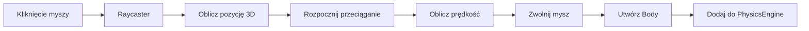

# 🏗️ Architektura Symulatora Grawitacyjnego

## 📋 Stack Technologiczny

- **Frontend Framework**: React 18 + TypeScript
- **Build Tool**: Vite
- **3D Engine**: Three.js
- **Styling**: CSS Modules / Styled Components
- **State Management**: React Hooks (useState, useRef, useCallback)
- **Kontrola kamery**: Three.js OrbitControls

---

## 📁 Struktura Projektu

```
projekt/
├── src/
│   ├── components/          # Komponenty React
│   │   ├── Scene3D.tsx     # Główna scena Three.js
│   │   ├── ControlPanel.tsx # Panel sterowania
│   │   ├── Slider.tsx      # Komponent suwaka
│   │   └── Button.tsx      # Komponent przycisku
│   ├── hooks/              # Custom React Hooks
│   │   ├── useSimulation.ts # Hook zarządzający symulacją
│   │   ├── useThreeScene.ts # Hook setupu Three.js
│   │   └── useMouseInteraction.ts # Hook interakcji myszą
│   ├── engine/             # Silnik fizyczny
│   │   ├── PhysicsEngine.ts # Główna logika fizyczna
│   │   ├── Body.ts         # Klasa ciała niebieskiego
│   │   └── Vector3D.ts     # Pomocnicze operacje wektorowe
│   ├── utils/              # Funkcje pomocnicze
│   │   ├── constants.ts    # Stałe fizyczne
│   │   └── helpers.ts      # Funkcje narzędziowe
│   ├── types/              # Definicje TypeScript
│   │   └── index.ts        # Wszystkie interfejsy i typy
│   ├── App.tsx             # Główny komponent aplikacji
│   ├── main.tsx            # Entry point
│   └── styles/             # Style globalne
│       └── global.css
├── public/
│   └── textures/           # Tekstury (opcjonalne)
├── package.json
├── tsconfig.json
├── vite.config.ts
└── README.md
```

---

## 🎯 Architektura Komponentów



---

## 🔄 Przepływ Danych



---

## 🧩 Szczegółowy Opis Komponentów

### 1. **App.tsx**
Główny komponent zarządzający stanem aplikacji.

**Odpowiedzialności:**
- Zarządzanie globalnym stanem (masa, szybkość, trajektorie)
- Koordynacja między Scene3D a ControlPanel
- Obsługa akcji użytkownika (pauza, reset)

**State:**
```typescript
interface AppState {
  mass: number;           // Masa nowo tworzonych obiektów
  timeScale: number;      // Szybkość symulacji (0.1 - 2.0)
  showTrails: boolean;    // Czy pokazywać trajektorie
  isPaused: boolean;      // Stan pauzy
}
```

---

### 2. **Scene3D.tsx**
Komponent zawierający renderowaną scenę Three.js.

**Odpowiedzialności:**
- Inicjalizacja sceny, kamery, renderera
- Obsługa interakcji myszą (dodawanie obiektów)
- Integracja z silnikiem fizycznym
- Pętla renderowania

**Kluczowe elementy:**
- Canvas ref dla Three.js
- OrbitControls dla kamery
- Raycaster dla wykrywania kliknięć
- Renderowanie trajektorii

---

### 3. **ControlPanel.tsx**
Panel UI z kontrolkami symulacji.

**Elementy UI:**
- Suwak masy (1 - 1000)
- Suwak szybkości czasu (0.1 - 2.0)
- Toggle trajektorii
- Przycisk Start/Pauza
- Przycisk Reset
- Przycisk Usuń wszystkie

**Stylizacja:**
- Pozycjonowany absolute/fixed
- Semi-transparentne tło
- Responsywny layout

---

### 4. **PhysicsEngine.ts**
Rdzeń logiki fizycznej symulacji.

**Główne metody:**
```typescript
class PhysicsEngine {
  bodies: Body[];
  G: number; // Stała grawitacyjna
  
  addBody(body: Body): void;
  removeBody(id: string): void;
  update(deltaTime: number): void;
  calculateGravity(): void;
  updatePositions(dt: number): void;
  checkCollisions(): void;
  reset(): void;
}
```

**Algorytm aktualizacji:**
1. Dla każdej pary ciał oblicz siłę grawitacji
2. Zsumuj siły dla każdego ciała
3. Oblicz przyspieszenie (F = ma)
4. Zaktualizuj prędkości (v += a * dt)
5. Zaktualizuj pozycje (p += v * dt)

---

### 5. **Body.ts**
Klasa reprezentująca pojedyncze ciało niebieskie.

```typescript
class Body {
  id: string;
  mass: number;
  position: Vector3;
  velocity: Vector3;
  acceleration: Vector3;
  mesh: THREE.Mesh;
  trail: THREE.Line;
  
  applyForce(force: Vector3): void;
  update(dt: number): void;
  updateMesh(): void;
  addTrailPoint(): void;
}
```

**Właściwości:**
- Rozmiar kuli proporcjonalny do log(masa)
- Kolor zależny od masy (gradient)
- Historia pozycji dla trajektorii (max 100 punktów)

---

## 🎮 System Interakcji

### Dodawanie Obiektów



**Implementacja:**
1. `onMouseDown`: Zapisz początkową pozycję
2. `onMouseMove`: Aktualizuj wektor prędkości (wizualizuj strzałką)
3. `onMouseUp`: Utwórz ciało z obliczoną prędkością

---

### Kontrola Kamery

**OrbitControls parametry:**
- `minDistance`: 10
- `maxDistance`: 500
- `enableDamping`: true
- `dampingFactor`: 0.05
- `enablePan`: true
- `panSpeed`: 1.0

---

## ⚙️ Parametry Fizyczne

### Stałe

```typescript
const CONSTANTS = {
  G: 0.5,                    // Stała grawitacyjna (dostosowana dla wizualizacji)
  MIN_DISTANCE: 0.5,         // Minimalna odległość (unikanie singularności)
  COLLISION_THRESHOLD: 2.0,  // Próg kolizji
  MAX_TRAIL_LENGTH: 100,     // Max punktów trajektorii
  TIME_STEP: 0.016,          // Delta czasu (60 FPS)
};
```

### Wzory Fizyczne

**Siła grawitacyjna:**
```
F = G * (m1 * m2) / r²
```

**Przyspieszenie:**
```
a = F / m
```

**Aktualizacja prędkości (Euler):**
```
v_new = v_old + a * dt
```

**Aktualizacja pozycji:**
```
p_new = p_old + v * dt
```

---

## 🎨 Rendering i Wizualizacja

### Scena Three.js

```typescript
// Setup
const scene = new THREE.Scene();
const camera = new THREE.PerspectiveCamera(75, aspect, 0.1, 1000);
const renderer = new THREE.WebGLRenderer({ antialias: true });

// Oświetlenie
const ambientLight = new THREE.AmbientLight(0x404040, 0.5);
const pointLight = new THREE.PointLight(0xffffff, 1, 100);

// Tło
scene.background = new THREE.Color(0x000011);
// Lub skybox z teksturami gwiazd
```

### Materiały Obiektów

```typescript
const material = new THREE.MeshPhongMaterial({
  color: getColorByMass(mass),
  emissive: 0x222222,
  shininess: 30,
  specular: 0x555555,
});
```

### Gradient Kolorów

```typescript
function getColorByMass(mass: number): number {
  // Mała masa: niebieski
  // Średnia masa: żółty/biały
  // Duża masa: czerwony/pomarańczowy
  const normalized = Math.log(mass) / Math.log(1000);
  return lerpColor(0x4444ff, 0xff4444, normalized);
}
```

### Trajektorie

```typescript
// Używamy THREE.Line z BufferGeometry
const geometry = new THREE.BufferGeometry();
const material = new THREE.LineBasicMaterial({
  color: bodyColor,
  transparent: true,
  opacity: 0.6,
});
const trail = new THREE.Line(geometry, material);
```

---

## 🔧 Custom Hooks

### useSimulation

```typescript
function useSimulation(config: SimulationConfig) {
  const engineRef = useRef<PhysicsEngine>(null);
  const animationRef = useRef<number>(null);
  
  const start = useCallback(() => { /* ... */ }, []);
  const pause = useCallback(() => { /* ... */ }, []);
  const reset = useCallback(() => { /* ... */ }, []);
  const addBody = useCallback((body: BodyParams) => { /* ... */ }, []);
  
  return { start, pause, reset, addBody, engine: engineRef.current };
}
```

### useThreeScene

```typescript
function useThreeScene(canvasRef: RefObject<HTMLCanvasElement>) {
  const [scene, setScene] = useState<THREE.Scene | null>(null);
  const [camera, setCamera] = useState<THREE.Camera | null>(null);
  const [renderer, setRenderer] = useState<THREE.Renderer | null>(null);
  
  useEffect(() => {
    // Initialize Three.js
    // Setup camera, lights, controls
    // Handle window resize
  }, []);
  
  return { scene, camera, renderer };
}
```

### useMouseInteraction

```typescript
function useMouseInteraction(
  canvasRef: RefObject<HTMLCanvasElement>,
  camera: THREE.Camera,
  onBodyCreate: (params: BodyParams) => void
) {
  const [isDragging, setIsDragging] = useState(false);
  const [startPoint, setStartPoint] = useState<Vector3 | null>(null);
  
  // Handle mouse events
  // Calculate 3D position from 2D click
  // Visualize velocity arrow
}
```

---

## 📊 Optymalizacje Wydajności

### 1. **Obliczenia Fizyczne**
- Quadtree/Octree dla optymalizacji kolizji (dla >100 obiektów)
- Ograniczenie liczby obiektów (max 50-100)
- Uproszczone obliczenia dla odległych obiektów

### 2. **Rendering**
- Frustum culling (automatyczne w Three.js)
- Level of Detail dla odległych obiektów
- Limit punktów trajektorii
- Instanced rendering dla podobnych obiektów

### 3. **Memory Management**
- Pooling obiektów
- Dispose geometrii i materiałów przy usuwaniu
- Ograniczona historia trajektorii

---

## 🧪 Scenariusze Testowe

### 1. **Układ dwóch ciał**
- Dwa obiekty o podobnej masie
- Oczekiwane: wzajemne orbitowanie

### 2. **System gwiazdowy**
- Jedno duże ciało (gwiazda) w centrum
- Kilka małych ciał (planety)
- Oczekiwane: stabilne orbity

### 3. **Problem trzech ciał**
- Trzy obiekty o różnych masach
- Oczekiwane: chaotyczne trajektorie

### 4. **Kolizja**
- Dwa obiekty na kursie kolizyjnym
- Oczekiwane: połączenie mas lub odbicie

---

## 🎯 Fazy Implementacji

### Faza 1: Podstawy (MVP)
- ✅ Setup projektu Vite + React + TypeScript
- ✅ Podstawowa scena Three.js
- ✅ Prosty silnik fizyczny (2 obiekty)
- ✅ Dodawanie obiektów kliknięciem

### Faza 2: Interaktywność
- ✅ Przeciąganie dla prędkości początkowej
- ✅ Panel kontrolny z suwakami
- ✅ Pauza/Reset/Clear
- ✅ Zmiana szybkości czasu

### Faza 3: Wizualizacja
- ✅ Trajektorie orbit
- ✅ Kolorowanie według masy
- ✅ Lepsze oświetlenie
- ✅ Tło kosmiczne

### Faza 4: Rozszerzenia
- ✅ Kolizje
- ✅ Predefiniowane scenariusze
- ✅ Zapis/odczyt stanu
- ✅ Więcej obiektów (optymalizacja)

---

## 📱 Responsywność

- Canvas zajmuje 100% viewport
- Panel kontrolny fixed/absolute
- Media queries dla mobile:
  - Kompaktowy panel
  - Touch events zamiast mouse
  - Uproszczone kontrolki

---

## 🚀 Uruchomienie

```bash
# Instalacja zależności
npm install

# Development
npm run dev

# Build
npm run build

# Preview build
npm run preview
```

---

## 📦 Główne Zależności

```json
{
  "dependencies": {
    "react": "^18.2.0",
    "react-dom": "^18.2.0",
    "three": "^0.160.0"
  },
  "devDependencies": {
    "@types/react": "^18.2.0",
    "@types/react-dom": "^18.2.0",
    "@types/three": "^0.160.0",
    "typescript": "^5.0.0",
    "vite": "^5.0.0"
  }
}
```

---

## 🎓 Dodatkowe Zasoby

- [Three.js Documentation](https://threejs.org/docs/)
- [React Three Fiber](https://docs.pmnd.rs/react-three-fiber) (alternatywna integracja)
- [N-Body Problem](https://en.wikipedia.org/wiki/N-body_problem)
- [Numerical Integration Methods](https://en.wikipedia.org/wiki/Numerical_integration)

---

## ✨ Przyszłe Możliwości Rozbudowy

1. **Ulepszona fizyka:**
   - Metoda Runge-Kutta zamiast Eulera
   - Efekty relatywistyczne
   - Deformacje przypływowe

2. **Więcej funkcji:**
   - Eksport animacji do video
   - Tryb VR/AR
   - Multiplayer (współdzielona symulacja)

3. **Edukacja:**
   - Wykresy energii/pędu
   - Mierzenie parametrów orbit
   - Tutorial mode

4. **Estetyka:**
   - Particle effects dla kolizji
   - Bloom/glow dla obiektów
   - Realistyczne tekstury planet